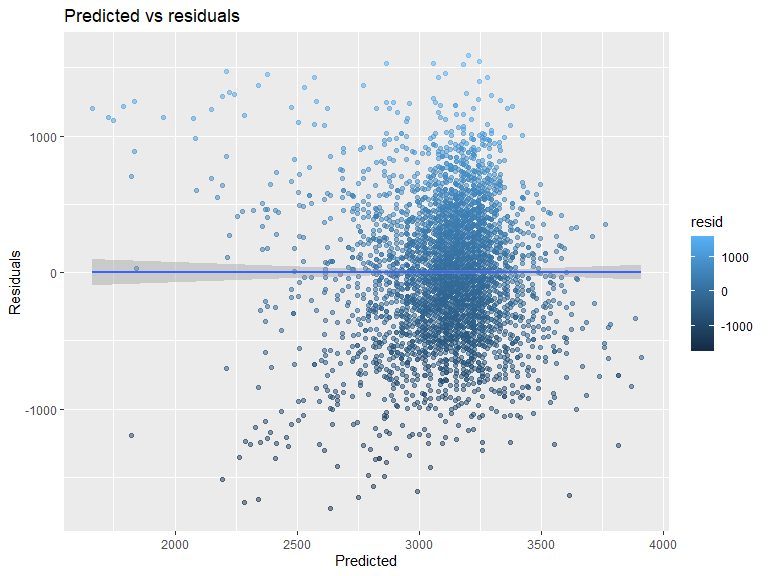
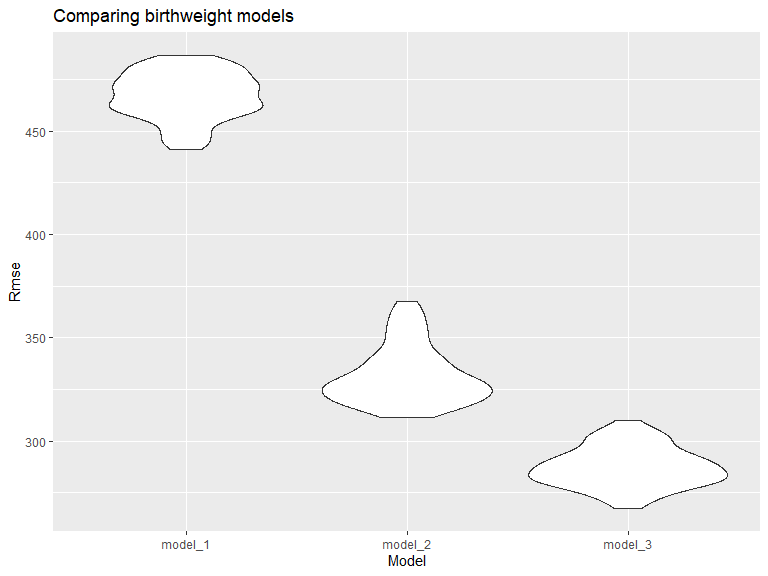

p8105\_hw6\_jl6048
================
Jinghan Liu

``` r
library(tidyverse)
library(readxl)
library(modelr)

knitr::opts_chunk$set(
  echo = TRUE,
  warning = FALSE,
  fig.width = 8,
  fig.height = 6,
  out.width = "90%")
```

## Problem 1

Load and clean the dataset for regression analysis:

``` r
child_df = 
  readr::read_csv("data/birthweight.csv") %>%
  janitor::clean_names() %>%
  mutate(
    babysex = as.factor(babysex),
    frace = as.factor(frace),
    mrace = as.factor(mrace),
    malform = as.factor(malform)
  )
```

    ## Rows: 4342 Columns: 20

    ## -- Column specification --------------------------------------------------------
    ## Delimiter: ","
    ## dbl (20): babysex, bhead, blength, bwt, delwt, fincome, frace, gaweeks, malf...

    ## 
    ## i Use `spec()` to retrieve the full column specification for this data.
    ## i Specify the column types or set `show_col_types = FALSE` to quiet this message.

``` r
# check for missing value - no missing
sum(complete.cases(child_df))
```

    ## [1] 4342

``` r
sum(!complete.cases(child_df))
```

    ## [1] 0

Propose a regression model for birthweight:

``` r
model_1 = lm(bwt ~ gaweeks, data = child_df)
summary(model_1)
```

    ## 
    ## Call:
    ## lm(formula = bwt ~ gaweeks, data = child_df)
    ## 
    ## Residuals:
    ##      Min       1Q   Median       3Q      Max 
    ## -1730.52  -292.85    -0.78   303.47  1591.36 
    ## 
    ## Coefficients:
    ##             Estimate Std. Error t value Pr(>|t|)    
    ## (Intercept)  476.003     88.809    5.36 8.76e-08 ***
    ## gaweeks       66.920      2.245   29.80  < 2e-16 ***
    ## ---
    ## Signif. codes:  0 '***' 0.001 '**' 0.01 '*' 0.05 '.' 0.1 ' ' 1
    ## 
    ## Residual standard error: 466.7 on 4340 degrees of freedom
    ## Multiple R-squared:  0.1699, Adjusted R-squared:  0.1697 
    ## F-statistic: 888.3 on 1 and 4340 DF,  p-value: < 2.2e-16

A plot of model residuals against fitted values:

``` r
child_df %>% 
  modelr::add_residuals(model_1) %>% 
  modelr::add_predictions(model_1) %>% 
  ggplot(aes(x = pred, y = resid, color = resid)) + 
  geom_point(alpha = 0.5)+ 
  stat_smooth(method = "lm") +
  labs(title = "Predicted vs residuals", 
       x = "Predicted", 
       y = "Residuals")
```

    ## `geom_smooth()` using formula 'y ~ x'



**Describe:** model\_1 is a simple linear regression with gestational
age as the predictor (X) and birth weight as Y. It can be seen from the
plot that the residuals are relatively evenly distributed around y = 0
and below. Therefore, it satisfies the linearity assumption.

Compare your model to two others:

``` r
# One using length at birth and gestational age as predictors (main effects only)
model_2 = lm(bwt ~ blength + gaweeks, data = child_df) %>%
  broom::glance()


#One using head circumference, length, sex, and all interactions (including the three-way interaction) between these
model_3 = lm(bwt ~bhead + blength + babysex + bhead*blength + bhead*babysex + blength*babysex + bhead*blength*babysex , data = child_df) %>%
  broom::glance()
```

Make this comparison in terms of the cross-validated prediction error:

``` r
cv_data =
  crossv_mc(child_df, 100) %>% 
  mutate(
    train = map(train, as_tibble),
    test = map(test, as_tibble))
cv_data 
```

    ## # A tibble: 100 x 3
    ##    train                 test                .id  
    ##    <list>                <list>              <chr>
    ##  1 <tibble [3,473 x 20]> <tibble [869 x 20]> 001  
    ##  2 <tibble [3,473 x 20]> <tibble [869 x 20]> 002  
    ##  3 <tibble [3,473 x 20]> <tibble [869 x 20]> 003  
    ##  4 <tibble [3,473 x 20]> <tibble [869 x 20]> 004  
    ##  5 <tibble [3,473 x 20]> <tibble [869 x 20]> 005  
    ##  6 <tibble [3,473 x 20]> <tibble [869 x 20]> 006  
    ##  7 <tibble [3,473 x 20]> <tibble [869 x 20]> 007  
    ##  8 <tibble [3,473 x 20]> <tibble [869 x 20]> 008  
    ##  9 <tibble [3,473 x 20]> <tibble [869 x 20]> 009  
    ## 10 <tibble [3,473 x 20]> <tibble [869 x 20]> 010  
    ## # ... with 90 more rows

``` r
cv_data = 
  cv_data %>% 
  mutate(
    model_1  = map(train, ~lm(bwt ~ gaweeks, data = .x)),
    model_2  = map(train, ~lm(bwt ~ blength + gaweeks, data = .x)),
    model_3  = map(train, ~lm(bwt ~ 
       bhead + blength + babysex + 
       bhead * blength + 
       bhead * babysex + 
       blength * babysex + 
       bhead * blength * babysex, data = .x))) %>% 
  mutate(
    rmse_model_1 = 
      map2_dbl(model_1, test, ~rmse(model = .x, data = .y)),
    rmse_model_2 = 
      map2_dbl(model_2, test, ~rmse(model = .x, data = .y)),
    rmse_model_3 =
      map2_dbl(model_3, test, ~rmse(model = .x, data = .y)))
cv_data
```

    ## # A tibble: 100 x 9
    ##    train                 test  .id   model_1 model_2 model_3 rmse_model_1 rmse_model_2
    ##    <list>                <lis> <chr> <list>  <list>  <list>         <dbl>        <dbl>
    ##  1 <tibble [3,473 x 20]> <tib~ 001   <lm>    <lm>    <lm>            459.         332.
    ##  2 <tibble [3,473 x 20]> <tib~ 002   <lm>    <lm>    <lm>            463.         306.
    ##  3 <tibble [3,473 x 20]> <tib~ 003   <lm>    <lm>    <lm>            471.         324.
    ##  4 <tibble [3,473 x 20]> <tib~ 004   <lm>    <lm>    <lm>            477.         336.
    ##  5 <tibble [3,473 x 20]> <tib~ 005   <lm>    <lm>    <lm>            470.         336.
    ##  6 <tibble [3,473 x 20]> <tib~ 006   <lm>    <lm>    <lm>            464.         326.
    ##  7 <tibble [3,473 x 20]> <tib~ 007   <lm>    <lm>    <lm>            467.         378.
    ##  8 <tibble [3,473 x 20]> <tib~ 008   <lm>    <lm>    <lm>            462.         333.
    ##  9 <tibble [3,473 x 20]> <tib~ 009   <lm>    <lm>    <lm>            451.         312.
    ## 10 <tibble [3,473 x 20]> <tib~ 010   <lm>    <lm>    <lm>            455.         321.
    ## # ... with 90 more rows, and 1 more variable: rmse_model_3 <dbl>

``` r
cv_data %>% 
  select(starts_with("rmse")) %>% 
  pivot_longer(
    everything(),
    names_to = "model", 
    values_to = "rmse",
    names_prefix = "rmse_") %>% 
  mutate(model = fct_inorder(model)) %>% 
  ggplot(aes(x = model, y = rmse)) + 
  geom_violin() +
   labs(
        title = "Comparing birthweight models",
        x = "Model",
        y = "Rmse"
      )
```



**Comment:** From this violin plot, it can be seen that the Rmse of the
first model is the highest, and the Rmse of the third model is the
lowest. The third model with interaction terms is the best model because
it has the lowest mean square value.
