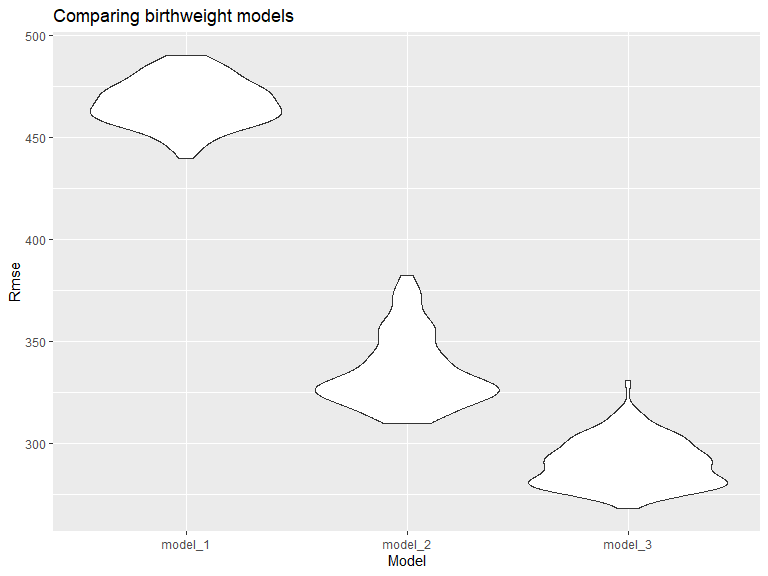

p8105\_hw6\_jl6048
================
Jinghan Liu

``` r
library(tidyverse)
library(readxl)
library(modelr)

knitr::opts_chunk$set(
  echo = TRUE,
  warning = FALSE,
  fig.width = 8,
  fig.height = 6,
  out.width = "90%")
```

### Problem 1

Load and clean the dataset for regression analysis:

``` r
child_df = 
  readr::read_csv("data/birthweight.csv") %>%
  janitor::clean_names() %>%
  mutate(
    babysex = as.factor(babysex),
    frace = as.factor(frace),
    mrace = as.factor(mrace),
    malform = as.factor(malform),
    babysex = fct_recode(babysex, "male" = "1", "female" = "2"),
    frace = fct_recode(frace, "white" = "1", "black" = "2", "asian" = "3", "puerto rican" = "4", "other" = "8", "unknown" = "9"),
    mrace = fct_recode(mrace, "white" = "1", "black" = "2", "asian" = "3","puerto rican" = "4", "other" = "8", "unknown" = "9"))
```

    ## Rows: 4342 Columns: 20

    ## -- Column specification --------------------------------------------------------
    ## Delimiter: ","
    ## dbl (20): babysex, bhead, blength, bwt, delwt, fincome, frace, gaweeks, malf...

    ## 
    ## i Use `spec()` to retrieve the full column specification for this data.
    ## i Specify the column types or set `show_col_types = FALSE` to quiet this message.

``` r
# check for missing value - no missing
sum(complete.cases(child_df))
```

    ## [1] 4342

``` r
sum(!complete.cases(child_df))
```

    ## [1] 0

Propose a regression model for birthweight:

``` r
model_1 = lm(bwt ~ gaweeks, data = child_df)
summary(model_1)
```

    ## 
    ## Call:
    ## lm(formula = bwt ~ gaweeks, data = child_df)
    ## 
    ## Residuals:
    ##      Min       1Q   Median       3Q      Max 
    ## -1730.52  -292.85    -0.78   303.47  1591.36 
    ## 
    ## Coefficients:
    ##             Estimate Std. Error t value Pr(>|t|)    
    ## (Intercept)  476.003     88.809    5.36 8.76e-08 ***
    ## gaweeks       66.920      2.245   29.80  < 2e-16 ***
    ## ---
    ## Signif. codes:  0 '***' 0.001 '**' 0.01 '*' 0.05 '.' 0.1 ' ' 1
    ## 
    ## Residual standard error: 466.7 on 4340 degrees of freedom
    ## Multiple R-squared:  0.1699, Adjusted R-squared:  0.1697 
    ## F-statistic: 888.3 on 1 and 4340 DF,  p-value: < 2.2e-16

A plot of model residuals against fitted values:

``` r
child_df %>% 
  modelr::add_residuals(model_1) %>% 
  modelr::add_predictions(model_1) %>% 
  ggplot(aes(x = pred, y = resid, color = resid)) + 
  geom_point(alpha = 0.5)+ 
  stat_smooth(method = "lm") +
  labs(title = "Predicted vs residuals", 
       x = "Predicted", 
       y = "Residuals")
```

    ## `geom_smooth()` using formula 'y ~ x'


**Describe:** model\_1 is a simple linear regression with gestational
age as the predictor (X) and birth weight as Y. It can be seen from the
plot that the residuals are relatively evenly distributed around y = 0
and below. Therefore, it satisfies the linearity assumption.

Compare your model to two others:

``` r
# One using length at birth and gestational age as predictors (main effects only)
model_2 = lm(bwt ~ blength + gaweeks, data = child_df)
summary(model_2) %>% 
  broom::tidy()
```

    ## # A tibble: 3 x 5
    ##   term        estimate std.error statistic  p.value
    ##   <chr>          <dbl>     <dbl>     <dbl>    <dbl>
    ## 1 (Intercept)  -4348.      98.0      -44.4 0       
    ## 2 blength        129.       1.99      64.6 0       
    ## 3 gaweeks         27.0      1.72      15.7 2.36e-54

``` r
#One using head circumference, length, sex, and all interactions (including the three-way interaction) between these
model_3 = lm(bwt ~bhead + blength + babysex + bhead*blength + bhead*babysex + blength*babysex + bhead*blength*babysex , data = child_df) 
summary(model_3) %>% 
  broom::tidy()
```

    ## # A tibble: 8 x 5
    ##   term                         estimate std.error statistic      p.value
    ##   <chr>                           <dbl>     <dbl>     <dbl>        <dbl>
    ## 1 (Intercept)                 -7177.     1265.       -5.67  0.0000000149
    ## 2 bhead                         182.       38.1       4.78  0.00000184  
    ## 3 blength                       102.       26.2       3.90  0.0000992   
    ## 4 babysexfemale                6375.     1678.        3.80  0.000147    
    ## 5 bhead:blength                  -0.554     0.780    -0.710 0.478       
    ## 6 bhead:babysexfemale          -198.       51.1      -3.88  0.000105    
    ## 7 blength:babysexfemale        -124.       35.1      -3.52  0.000429    
    ## 8 bhead:blength:babysexfemale     3.88      1.06      3.67  0.000245

Make this comparison in terms of the cross-validated prediction error:

``` r
cv_data =
  crossv_mc(child_df, 100) %>% 
  mutate(
    train = map(train, as_tibble),
    test = map(test, as_tibble))
```

``` r
cv_data = 
  cv_data %>% 
  mutate(
    model_1  = map(train, ~lm(bwt ~ gaweeks, data = .x)),
    model_2  = map(train, ~lm(bwt ~ blength + gaweeks, data = .x)),
    model_3  = map(train, ~lm(bwt ~ 
       bhead + blength + babysex + 
       bhead * blength + 
       bhead * babysex + 
       blength * babysex + 
       bhead * blength * babysex, data = .x))) %>% 
  mutate(
    rmse_model_1 = 
      map2_dbl(model_1, test, ~rmse(model = .x, data = .y)),
    rmse_model_2 = 
      map2_dbl(model_2, test, ~rmse(model = .x, data = .y)),
    rmse_model_3 =
      map2_dbl(model_3, test, ~rmse(model = .x, data = .y)))
```

``` r
cv_data %>% 
  select(starts_with("rmse")) %>% 
  pivot_longer(
    everything(),
    names_to = "model", 
    values_to = "rmse",
    names_prefix = "rmse_") %>% 
  mutate(model = fct_inorder(model)) %>% 
  ggplot(aes(x = model, y = rmse)) + 
  geom_violin() +
   labs(
        title = "Comparing birthweight models",
        x = "Model",
        y = "Rmse"
      )
```



**Comment:** From this violin plot, it can be seen that the Rmse of the
first model is the highest, and the Rmse of the third model is the
lowest. The third model with interaction terms is the best model because
it has the lowest mean square value.

### Problem 2:

Load data

``` r
weather_df = 
  rnoaa::meteo_pull_monitors(
    c("USW00094728"),
    var = c("PRCP", "TMIN", "TMAX"), 
    date_min = "2017-01-01",
    date_max = "2017-12-31") %>%
  mutate(
    name = recode(id, USW00094728 = "CentralPark_NY"),
    tmin = tmin / 10,
    tmax = tmax / 10) %>%
  select(name, id, everything())
```

    ## Registered S3 method overwritten by 'hoardr':
    ##   method           from
    ##   print.cache_info httr

    ## using cached file: C:\Users\liuji\AppData\Local/Cache/R/noaa_ghcnd/USW00094728.dly

    ## date created (size, mb): 2021-12-02 13:34:02 (7.629)

    ## file min/max dates: 1869-01-01 / 2021-11-30

``` r
weather_df 
```

    ## # A tibble: 365 x 6
    ##    name           id          date        prcp  tmax  tmin
    ##    <chr>          <chr>       <date>     <dbl> <dbl> <dbl>
    ##  1 CentralPark_NY USW00094728 2017-01-01     0   8.9   4.4
    ##  2 CentralPark_NY USW00094728 2017-01-02    53   5     2.8
    ##  3 CentralPark_NY USW00094728 2017-01-03   147   6.1   3.9
    ##  4 CentralPark_NY USW00094728 2017-01-04     0  11.1   1.1
    ##  5 CentralPark_NY USW00094728 2017-01-05     0   1.1  -2.7
    ##  6 CentralPark_NY USW00094728 2017-01-06    13   0.6  -3.8
    ##  7 CentralPark_NY USW00094728 2017-01-07    81  -3.2  -6.6
    ##  8 CentralPark_NY USW00094728 2017-01-08     0  -3.8  -8.8
    ##  9 CentralPark_NY USW00094728 2017-01-09     0  -4.9  -9.9
    ## 10 CentralPark_NY USW00094728 2017-01-10     0   7.8  -6  
    ## # ... with 355 more rows

For R squared:

``` r
bootstrap_r =
  weather_df %>% 
  modelr::bootstrap(n = 5000) %>% 
  mutate(
    models = map(strap, ~lm( tmax ~ tmin , data = .x) ),
    results = map(models, broom::glance)) %>% 
  select(.id, results) %>% 
  unnest(results)
bootstrap_r
```

    ## # A tibble: 5,000 x 13
    ##    .id   r.squared adj.r.squared sigma statistic   p.value    df logLik   AIC
    ##    <chr>     <dbl>         <dbl> <dbl>     <dbl>     <dbl> <dbl>  <dbl> <dbl>
    ##  1 0001      0.911         0.911  3.00     3706. 1.38e-192     1  -918. 1841.
    ##  2 0002      0.903         0.903  2.96     3391. 3.18e-186     1  -913. 1833.
    ##  3 0003      0.903         0.902  3.06     3363. 1.22e-185     1  -926. 1857.
    ##  4 0004      0.910         0.910  3.11     3661. 1.04e-191     1  -931. 1868.
    ##  5 0005      0.920         0.920  2.80     4178. 3.10e-201     1  -893. 1791.
    ##  6 0006      0.921         0.921  2.89     4249. 1.88e-202     1  -904. 1815.
    ##  7 0007      0.926         0.926  2.65     4557. 1.48e-207     1  -873. 1752.
    ##  8 0008      0.907         0.907  2.83     3537. 3.07e-189     1  -897. 1800.
    ##  9 0009      0.907         0.906  3.00     3521. 6.56e-189     1  -918. 1842.
    ## 10 0010      0.908         0.908  2.93     3594. 2.20e-190     1  -910. 1826.
    ## # ... with 4,990 more rows, and 4 more variables: BIC <dbl>, deviance <dbl>,
    ## #   df.residual <int>, nobs <int>

``` r
bootstrap_r %>% 
ggplot(aes(x = r.squared)) + 
  geom_density() +
   labs(
      x = "R squared values",
      y = "Density",
      title = "Distribution of R Squared Estimates")
```


For log of betas:

``` r
bootstrap_log =
  weather_df %>% 
   modelr::bootstrap(n = 5000)%>% 
  mutate(
    models = map(strap, ~lm( tmax ~ tmin , data = .x) ),
    results = map(models, broom::tidy)) %>% 
  select(.id, results) %>% 
  unnest(results)%>% 
  select(.id, term, estimate) %>% 
  pivot_wider(
    names_from = term,
    values_from = estimate
  ) %>% 
  janitor::clean_names() %>% 
  mutate(
    beta_log = log(intercept * tmin)
  ) 
bootstrap_log
```

    ## # A tibble: 5,000 x 4
    ##    id    intercept  tmin beta_log
    ##    <chr>     <dbl> <dbl>    <dbl>
    ##  1 0001       7.10  1.04     2.00
    ##  2 0002       7.53  1.02     2.04
    ##  3 0003       6.82  1.07     1.98
    ##  4 0004       7.14  1.05     2.02
    ##  5 0005       7.55  1.03     2.05
    ##  6 0006       7.20  1.04     2.01
    ##  7 0007       7.35  1.02     2.01
    ##  8 0008       7.28  1.04     2.02
    ##  9 0009       7.77  1.01     2.06
    ## 10 0010       6.82  1.06     1.97
    ## # ... with 4,990 more rows

``` r
bootstrap_log %>% 
ggplot(aes(x = beta_log)) + 
  geom_density() +
   labs(
      x = "Log coefficients values",
      y = "Density",
      title = "Distribution of log coefficients Estimates")
```


**Comment:** From the distribution plot, we can easily find that the
distribution of R Squared looks like a normal distribution but slightly
left skewed. The log plot looks like more skewed to the normal
distribution than R.

Confidence Interval :

``` r
bootstrap_r %>% 
  summarize(
    CI_lower_r = quantile(r.squared, 0.025),
    CI_upper_r = quantile(r.squared, 0.975)
  ) %>% 
  knitr::kable(digits = 3)
```

| CI\_lower\_r | CI\_upper\_r |
|-------------:|-------------:|
|        0.895 |        0.927 |

``` r
bootstrap_log %>% 
  summarize(
    CI_lower_log = quantile(beta_log, 0.025),
    CI_upper_log = quantile(beta_log, 0.975)
  ) %>% 
  knitr::kable(digits = 3)
```

| CI\_lower\_log | CI\_upper\_log |
|---------------:|---------------:|
|          1.965 |          2.058 |
